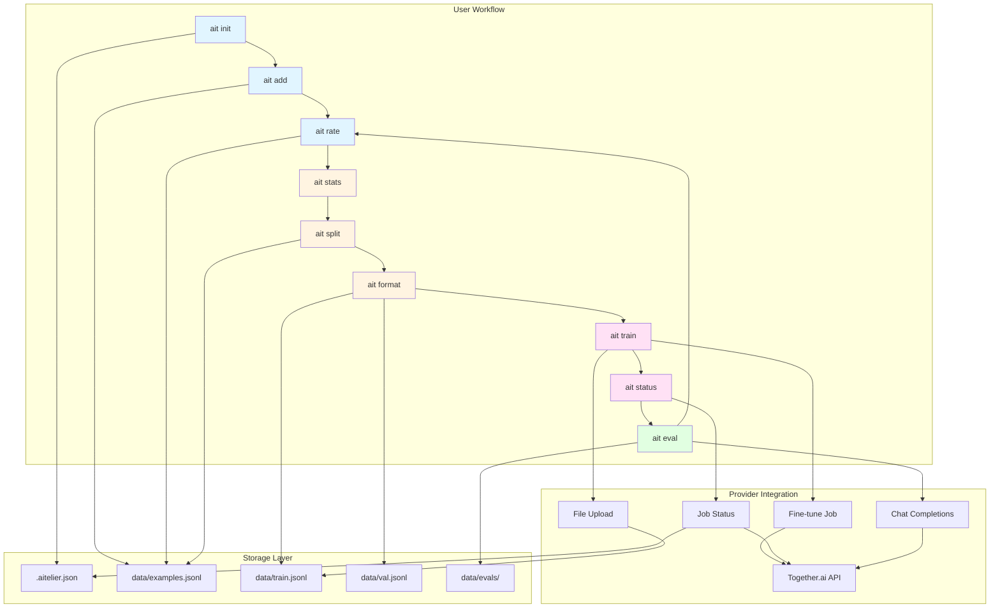

# aitelier

[](https://www.npmjs.com/package/aitelier)
[](https://github.com/furkantanyol/aitelier/actions/workflows/ci.yml)
[](https://opensource.org/licenses/MIT)
[](https://nodejs.org/)
[](https://www.typescriptlang.org/)

> Your AI atelier - craft fine-tuned models

**aitelier** is an opinionated workflow tool for managing the full lifecycle of fine-tuning datasets — from collecting examples to shipping production models. Vendor-agnostic, supports Together.ai with OpenAI support planned.

Built for indie hackers and small teams fine-tuning open-source models (Llama, Mistral) via LoRA with 50-500 training examples iterating weekly.

## Demo

[](https://vhs.charm.sh)

_Full workflow: `ait init` → `ait add` → `ait rate` → `ait split` → `ait train` → `ait eval`_

---

## Table of Contents

- [Why This Exists](#why-this-exists)
- [Use Cases](#use-cases)
- [Features](#features)
- [Installation](#installation)
- [Quick Start](#quick-start)
- [Project Structure](#project-structure)
- [Commands](#commands)
  - [ait init](#ait-init)
  - [ait add](#ait-add)
  - [ait rate](#ait-rate)
  - [ait stats](#ait-stats)
  - [ait format](#ait-format)
  - [ait split](#ait-split)
  - [ait train](#ait-train)
  - [ait status](#ait-status)
  - [ait eval](#ait-eval)
- [Provider Setup](#provider-setup)
- [Architecture](#architecture)
- [Development](#development)
- [Troubleshooting](#troubleshooting)
- [Roadmap](#roadmap)
- [Contributing](#contributing)
- [License](#license)

---

## Why This Exists

**The Problem:** Fine-tuning LLMs usually means:

- 📂 Manually managing JSONL files scattered across directories
- 🐍 Writing throwaway Python scripts for train/val splits
- 📋 Copy-pasting evaluation results between terminal and spreadsheets
- 🚫 No version control for dataset quality improvements
- 🔄 Re-inventing the same workflow for every new fine-tuning project

**The Solution:** **aitelier** gives you a clean, repeatable CLI workflow:

```bash
ait init        # Set up project
ait add         # Collect training examples interactively
ait rate        # Review and score examples
ait stats       # Check dataset health
ait split       # Create train/val split
ait format      # Export to provider format
ait train       # Kick off fine-tune job
ait status      # Monitor training
ait eval        # Evaluate on validation set
```

**Who it's for:**

- Indie hackers shipping AI features with custom models
- Small teams fine-tuning open-source models (Llama, Mistral)
- Engineers iterating on 50-500 training examples weekly
- Anyone tired of managing fine-tuning workflows manually

---

## Use Cases

### Customer Support Bot

Fine-tune a model on your company's support tickets to handle common questions.

**Example workflow:**

```bash
ait init
# → Project: support-bot
# → Model: meta-llama/Llama-3.3-70B-Instruct
# → System prompt: You are a helpful customer support assistant for Acme Corp.

ait add
# → Input: How do I reset my password?
# → Output: Visit https://acme.com/reset and enter your email...
# → Rate: 9

# Add 50-100 more examples...

ait stats
# → 85 examples, 80% rated 8+

ait split && ait format && ait train
# → Training job started

ait eval --compare
# → Base model: 65% sendable
# → Fine-tuned: 92% sendable (+27% improvement)
```

**Result:** Deploy a model that handles 70-80% of support tickets accurately, escalating only edge cases to humans.

---

### Code Review Assistant

Train a model to provide project-specific code review feedback.

**Example workflow:**

```bash
ait init
# → Project: code-reviewer
# → System prompt: You are a code reviewer for a Python web app using FastAPI...

ait add
# → Input: [code snippet with security issue]
# → Output: This endpoint is vulnerable to SQL injection...
# → Rate: 10

# Collect examples from past PR reviews

ait train && ait eval
# → Model learns your team's code review standards
```

**Result:** Get consistent, high-quality first-pass code reviews that catch common issues.

---

### Domain-Specific Q&A

Fine-tune on internal documentation, technical specs, or research papers.

**Examples:**

- Legal contract analysis
- Medical diagnosis assistance (research use)
- Financial report summarization
- Engineering documentation Q&A

---

## Features

- ✅ **Interactive data collection** — paste inputs/outputs, rate examples on the fly
- ✅ **Quality control** — rate examples 1-10, rewrite poor outputs inline
- ✅ **JSONL-native storage** — no database, everything is portable JSONL files (git-friendly)
- ✅ **Smart train/val splitting** — automatic 80/20 with stratification by rating, locked validation sets
- ✅ **Provider integration** — Together.ai fine-tuning with LoRA (epochs, batch size, learning rate, LoRA rank/alpha)
- ✅ **Job monitoring** — track training status, automatic model ID saving
- ✅ **Evaluation workflow** — interactive validation scoring with blind A/B testing vs base model
- ✅ **Statistical analysis** — dataset health checks, rating distributions, sendable rate metrics
- ✅ **Monorepo architecture** — built with Turborepo, ready for future web UI extension

## Installation

**Option 1: npm (recommended)**

```bash
# Global install
npm install -g aitelier

# Verify installation
ait --version
```

**Option 2: Homebrew (macOS/Linux)**

```bash
# Tap the repository
brew tap furkantanyol/aitelier https://github.com/furkantanyol/aitelier

# Install
brew install aitelier

# Verify installation
ait --version
```

**Option 3: npx (no install)**

```bash
# Run commands directly without installing
npx aitelier init
npx aitelier add
# ... other commands
```

**Option 4: Development install**

```bash
git clone https://github.com/furkantanyol/aitelier.git
cd aitelier
pnpm install
pnpm turbo build
pnpm --filter aitelier exec tsx src/index.ts --help
```

**Requirements:**

- Node.js 20 or higher
- npm, pnpm, or yarn (for npm install)
- Homebrew (for brew install)
- Together.ai API key (for training and evaluation)

## Quick Start

```bash
# Initialize a new fine-tuning project
ait init
# → What's your project name? my-support-bot
# → Which provider? Together.ai
# → Base model? meta-llama/Llama-3.3-70B-Instruct
# → Created .aitelier.json and data/ directory

# Add training examples interactively
ait add
# → Paste the input (user message): How do I reset my password?
# → Paste the ideal output (assistant message): You can reset your password at...
# → Rate this example (1-10, or skip): 9
# → Saved example #1 to data/examples.jsonl

# Review and rate existing examples
ait rate
# → Shows examples one by one with rating prompts

# Check dataset health
ait stats
# → 25 total examples (20 rated, 5 unrated)
# → Rating distribution: ██████░░ 8+ (18) | ███░ 5-7 (2)
# → Ready for training: Yes

# Create train/validation split
ait split
# → Split 20 examples: 16 train, 4 val (80/20)

# Export to provider format
ait format
# → Exported to data/train.jsonl (16 examples)
# → Exported to data/val.jsonl (4 examples)

# Start fine-tuning job
export TOGETHER_API_KEY=your_api_key
ait train
# → Uploading data/train.jsonl...
# → Job ID: ait-abc123
# → Run `ait status` to check progress

# Monitor training
ait status
# → Job ait-abc123: COMPLETED ✓
# → Model: username/Llama-3.3-70B-Instruct-my-support-bot-v1

# Evaluate on validation set
ait eval
# → Running 4 validation examples...
# → Results: Avg score 8.5 | Sendable 4/4 (100%)
```

## Project Structure

When you run `ait init`, it creates:

```
your-project/
├── .aitelier.json    # Project config (provider, model, runs history)
└── data/
    ├── examples.jsonl  # Raw examples with ratings and metadata
    ├── train.jsonl     # Formatted training split
    ├── val.jsonl       # Formatted validation split (locked)
    └── evals/          # Evaluation results per run
```

## Commands

### `ait init`

Initialize a new fine-tuning project with interactive prompts.

**Example:**

```bash
ait init
# → What's your project name? customer-support-bot
# → Which provider? Together.ai
# → Base model? meta-llama/Llama-3.3-70B-Instruct
# → System prompt? You are a helpful customer support assistant.
# → Quality threshold (1-10)? 8
# → Created .aitelier.json and data/ directory
```

Creates `.aitelier.json` config and `data/` directory structure.

---

### `ait add`

Add training examples interactively or from files.

**Interactive mode:**

```bash
ait add
# → Paste the input (user message): How do I reset my password?
# → Paste the ideal output: You can reset your password by visiting...
# → Rate this example (1-10, or skip): 9
# → Saved example #1 to data/examples.jsonl
```

**File mode:**

```bash
ait add --input user-message.txt --output assistant-response.txt
# → Saved example #1 to data/examples.jsonl
```

---

### `ait rate`

Review and rate examples interactively. Shows unrated examples first, then allows filtering.

**Basic usage:**

```bash
ait rate
# → Example 1/10
# → Input: How do I reset my password?
# → Output: You can reset your password by...
# → Rate this example (1-10): 8
```

**Review only low-rated examples:**

```bash
ait rate --min 8
# → Only shows examples rated below 8 for re-review
```

**Actions per example:**

- Rate 1-10
- Rewrite output inline (saves original as metadata)
- Skip
- Quit

---

### `ait stats`

Show dataset health and statistics.

**Example output:**

```bash
ait stats
# ══════════════════════════════════════════════════════════════════════
# 📊 Dataset Statistics
# ══════════════════════════════════════════════════════════════════════
#
# Total examples: 25
# Rated: 20 | Unrated: 5
#
# Rating Distribution (1-10):
# ━━━━━━━━━━━━━━━━━━━━━━━━━━━━━━━━━━━━━━━━━━━━━━━━━━━━━━━━━━━━━━━━━━━━━━
#  10 │ ████████░░ (8 examples)
#   9 │ ██████░░░░ (6 examples)
#   8 │ ███░░░░░░░ (3 examples)
#   7 │ █░░░░░░░░░ (1 example)
#  5-6│ █░░░░░░░░░ (2 examples)
#  <5 │ ░░░░░░░░░░ (0 examples)
#
# Quality Threshold: 8+
# Above threshold: 17/20 (85%)
#
# Train/Val Split:
# Train: 16 examples | Val: 4 examples (locked)
#
# ✓ Ready for training
```

---

### `ait format`

Export rated examples to provider-specific JSONL format for training.

**Usage:**

```bash
ait format
# → Filtered 20 examples → 17 above threshold (rating ≥ 8)
# → Exported 13 examples to data/train.jsonl
# → Exported 4 examples to data/val.jsonl
```

**Options:**

- `--provider <name>` — Target provider (together, openai) - defaults to config
- `--min-rating <n>` — Minimum rating threshold (default: 8)

Only exports examples that are:

- Rated at or above threshold
- Assigned to train/val split

---

### `ait split`

Create or manage train/validation split with stratification.

**Basic usage:**

```bash
ait split
# → Split 20 examples: 16 train, 4 val (80/20 split)
# → Stratified by rating
```

**Custom ratio:**

```bash
ait split --ratio 0.9
# → Split 20 examples: 18 train, 2 val (90/10 split)
```

**Force reshuffle (with confirmation):**

```bash
ait split --reshuffle
# → Warning: This will re-assign validation examples to training
# → Continue? (y/N): y
```

**Options:**

- `--ratio <n>` — Train ratio, e.g., 0.8 for 80/20 (default: 0.8)
- `--reshuffle` — Force re-split with confirmation (breaks validation lock)

**Note:** Validation set is locked once assigned. Use `--reshuffle` only if you need to change the split.

---

### `ait train`

Start a fine-tuning job on Together.ai with LoRA.

**Prerequisites:**

Set your API key using either method:

```bash
# Option 1: .env file (recommended)
echo "TOGETHER_API_KEY=your_api_key_here" > .env

# Option 2: Environment variable
export TOGETHER_API_KEY=your_api_key_here
```

**Basic usage:**

```bash
ait train
# → Uploading data/train.jsonl...
# → Starting fine-tune job...
# → Job ID: ait-abc123xyz
# → Saved run to .aitelier.json
# → Run `ait status` to check progress
```

**Custom hyperparameters:**

```bash
ait train --epochs 5 --batch-size 8 --learning-rate 2e-5 --lora-r 32 --lora-alpha 64
```

**Options:**

- `--epochs <n>` — Number of training epochs (default: 3)
- `--batch-size <n>` — Training batch size (default: 4)
- `--learning-rate <rate>` — Learning rate (default: 1e-5)
- `--lora-r <rank>` — LoRA rank/dimension (default: 16)
- `--lora-alpha <alpha>` — LoRA alpha scaling parameter (default: 32)

**Requirements:**

- `TOGETHER_API_KEY` environment variable must be set
- `data/train.jsonl` must exist (run `ait format` first)

---

### `ait status`

Monitor fine-tuning job progress.

**Check latest job:**

```bash
ait status
# → Job ait-abc123xyz: RUNNING
# → Started: 2026-02-11 10:30:00
# → Epochs: 3 | Batch size: 4
```

**Show all training runs:**

```bash
ait status --all
# ══════════════════════════════════════════════════════════════════════
# 📋 Training Runs
# ══════════════════════════════════════════════════════════════════════
#
# Run #1 (2026-02-11)
# Job ID: ait-abc123xyz
# Status: COMPLETED ✓
# Model: username/Llama-3.3-70B-my-bot-v1
# Config: 3 epochs, batch 4, lr 1e-5, LoRA r=16 α=32
# Training examples: 16
#
# Run #2 (2026-02-10)
# Job ID: ait-def456uvw
# Status: COMPLETED ✓
# Model: username/Llama-3.3-70B-my-bot-v0
```

**Options:**

- `--all` — Show all runs with full details and model IDs

---

### `ait eval`

Evaluate fine-tuned model on validation set with interactive scoring.

**Basic evaluation:**

```bash
ait eval
# → Running fine-tuned model on 4 validation examples...
# → Model: username/Llama-3.3-70B-my-bot-v1
#
# ──────────────────────────────────────────────────────────────────────
# Example 1/4
# ──────────────────────────────────────────────────────────────────────
# Input: How do I reset my password?
#
# Expected Output:
# You can reset your password by visiting...
#
# Model Output:
# To reset your password, please go to...
#
# → Score this output (1-5, skip, or quit): 4
```

**Final results:**

```bash
# ══════════════════════════════════════════════════════════════════════
# 📊 Evaluation Results
# ══════════════════════════════════════════════════════════════════════
#
# Evaluated: 4/4 examples
# Average score: 4.25 / 5
# Sendable rate: 3/4 (75%) — examples rated 4+
#
# Results saved to data/evals/eval-username-Llama-3.3-70B-my-bot-v1-2026-02-11.json
```

**Blind A/B comparison (base model vs fine-tuned):**

```bash
ait eval --compare
# → Running both base and fine-tuned models...
#
# ──────────────────────────────────────────────────────────────────────
# Example 1/4
# ──────────────────────────────────────────────────────────────────────
# Input: How do I reset my password?
#
# Expected Output:
# You can reset your password by visiting...
#
# Model A:
# To reset your password, click the "Forgot Password" link...
#
# → Score Model A (1-5): 4
#
# Model B:
# You can reset your password by visiting the settings page...
#
# → Score Model B (1-5): 5
```

**Comparison results:**

```bash
# ══════════════════════════════════════════════════════════════════════
# 🔬 A/B Comparison Results
# ══════════════════════════════════════════════════════════════════════
#
# Base Model (meta-llama/Llama-3.3-70B-Instruct):
#   Average score: 3.75 / 5
#   Win rate: 25% (1/4)
#   Sendable rate: 50% (2/4)
#
# Fine-Tuned Model (username/Llama-3.3-70B-my-bot-v1):
#   Average score: 4.5 / 5
#   Win rate: 75% (3/4)
#   Sendable rate: 100% (4/4)
#
# Head-to-head: Fine-tuned wins 3, Base wins 1
# Improvement: +0.75 points (+20%)
#
# Results saved to data/evals/compare-username-Llama-3.3-70B-my-bot-v1-2026-02-11.json
```

**Options:**

- `--compare` — Run blind A/B test comparing base model vs fine-tuned model (boolean flag, no argument)

## Provider Setup

### Together.ai (Primary)

**Why Together.ai?**

- Cheapest LoRA fine-tuning ($0.008/1K tokens for Llama 70B)
- Fast training (typically completes in 10-30 minutes)
- OpenAI-compatible API format
- Supports latest Llama 3.3 and Mistral models

**Setup steps:**

1. **Create account** — Sign up at [together.ai](https://together.ai)

2. **Add credits** — Fine-tuning requires credits (minimum $10). Training a 70B model on 100 examples typically costs $2-5.

3. **Get API key** — Navigate to Settings → API Keys → Create New Key

4. **Set environment variable:**

   ```bash
   # For current session
   export TOGETHER_API_KEY=your_api_key_here

   # Permanently (add to shell profile)
   echo 'export TOGETHER_API_KEY=your_api_key_here' >> ~/.zshrc
   source ~/.zshrc
   ```

5. **Initialize project:**

   ```bash
   ait init
   # → Select "Together.ai" when prompted
   # → Choose base model (e.g., meta-llama/Llama-3.3-70B-Instruct)
   ```

**Recommended models:**

- `meta-llama/Llama-3.3-70B-Instruct` — Best quality, higher cost
- `meta-llama/Llama-3.2-11B-Instruct` — Good balance
- `mistralai/Mistral-7B-Instruct-v0.3` — Fastest, cheapest

**Cost estimation:**

| Model Size | Training (100 examples) | Inference (1K calls) |
| ---------- | ----------------------- | -------------------- |
| 7B         | ~$1                     | ~$2                  |
| 11B        | ~$2                     | ~$4                  |
| 70B        | ~$4                     | ~$8                  |

---

### OpenAI (Coming Soon)

OpenAI fine-tuning support is planned and straightforward to add (formats are nearly identical to Together.ai).

**Expected workflow:**

```bash
# Set OpenAI API key
export OPENAI_API_KEY=your_key

# Initialize with OpenAI
ait init
# → Select "OpenAI"
# → Choose base model (e.g., gpt-4o-mini)
```

**Tracked in:** Roadmap (Future)

## Development

**Prerequisites:**

- Node.js 20+
- pnpm 9+ (install with `npm install -g pnpm`)

**Setup:**

```bash
# Clone repository
git clone https://github.com/yourusername/aitelier.git
cd aitelier

# Install dependencies
pnpm install

# Build all packages
pnpm turbo build
```

**Development workflow:**

```bash
# Run CLI locally during development
pnpm --filter aitelier exec tsx src/index.ts --help
pnpm --filter aitelier exec tsx src/index.ts init

# Run tests
pnpm turbo test                                    # All tests
pnpm --filter aitelier exec vitest             # Watch mode
pnpm --filter aitelier exec vitest run src/commands/init.test.ts  # Single file

# Lint and format
pnpm turbo lint
pnpm prettier --write .

# Full verification suite (run before committing)
pnpm turbo build && pnpm prettier --write . && pnpm turbo lint && pnpm turbo test
```

**Project structure:**

- `packages/cli/` — Core CLI package
- `packages/cli/src/commands/` — Command implementations
- `packages/cli/src/providers/` — Provider API integrations
- `packages/cli/src/storage/` — JSONL file operations
- `TASKS.md` — Development task tracking
- `CLAUDE.md` — AI pair programming instructions

**Adding a new command:**

1. Create `packages/cli/src/commands/your-command.ts`
2. Export `registerYourCommand(program: Command)` function
3. Register in `packages/cli/src/index.ts`
4. Add tests in `packages/cli/src/commands/your-command.test.ts`
5. Update TASKS.md

**Adding a new provider:**

1. Implement `Provider` interface from `packages/cli/src/providers/types.ts`
2. Create `packages/cli/src/providers/your-provider.ts`
3. Add to provider factory in `init.ts`
4. Add tests

## Architecture

### Tech Stack

- **Runtime:** Node.js 20+ with TypeScript (strict mode)
- **CLI Framework:** Commander.js + Inquirer.js (interactive prompts)
- **Monorepo:** Turborepo + pnpm workspaces
- **Testing:** Vitest with comprehensive test coverage
- **Linting:** ESLint + Prettier
- **API Clients:** Native fetch for provider APIs (Together.ai)

### Storage Model

**JSONL-native, no database.** Training data is JSONL natively — simple, portable, git-versionable.

- `data/examples.jsonl` — raw examples with ratings and metadata
- `data/train.jsonl` — formatted training split
- `data/val.jsonl` — formatted validation split (locked once assigned)
- `data/evals/` — evaluation results per run
- `.aitelier.json` — project config and training run history

### System Diagram



### Package Structure

```
aitelier/
├── packages/
│   ├── cli/                    # Core CLI package (ships first)
│   │   ├── src/
│   │   │   ├── commands/       # One file per command
│   │   │   │   ├── init.ts
│   │   │   │   ├── add.ts
│   │   │   │   ├── rate.ts
│   │   │   │   ├── stats.ts
│   │   │   │   ├── format.ts
│   │   │   │   ├── split.ts
│   │   │   │   ├── train.ts
│   │   │   │   ├── status.ts
│   │   │   │   └── eval.ts
│   │   │   ├── providers/      # Provider integrations
│   │   │   │   ├── types.ts    # Common provider interface
│   │   │   │   └── together.ts # Together.ai implementation
│   │   │   ├── storage/        # JSONL persistence
│   │   │   │   ├── dataset.ts  # Read/write examples
│   │   │   │   └── config.ts   # Project config management
│   │   │   └── index.ts        # CLI entrypoint
│   │   └── package.json
│   └── web/                    # React web UI (future)
├── .aitelier.json            # Example project config
├── CLAUDE.md                   # Project instructions for Claude Code
├── TASKS.md                    # Development task tracking
└── README.md
```

### Design Principles

1. **CLI-first, web later** — Target users live in the terminal. Web UI only if CLI gets traction.
2. **JSONL as the database** — No SQLite/Postgres. JSONL is the native training format — simple, portable, git-versionable.
3. **Together.ai first** — Cheapest LoRA fine-tuning with OpenAI-compatible API. OpenAI support planned.
4. **Provider interface** — All providers implement a common interface (`providers/types.ts`). Adding a new provider means implementing that interface.
5. **Locked validation sets** — Once a validation split is created, those examples stay in validation to ensure consistent evaluation across training runs.

## Roadmap

### ✅ Completed (v0.1.0)

- [x] Core CLI commands (init, add, rate, stats)
- [x] Together.ai integration (format, split, train, status)
- [x] Evaluation workflow (eval, compare with blind A/B testing)
- [x] JSONL-native storage with validation set locking
- [x] Interactive prompts and quality control
- [x] Comprehensive test coverage
- [x] Package publishing to npm and Homebrew
- [x] Example projects (customer support, code review)
- [x] CI/CD with GitHub Actions

### 🚧 In Progress

- [ ] OpenAI provider support

### 🔮 Future

- [ ] Web UI (React-based rating interface, optional)
- [ ] Multi-turn conversation support
- [ ] Fireworks.ai provider support
- [ ] Dataset versioning and diff tools
- [ ] Export to other fine-tuning platforms (HuggingFace, Replicate)
- [ ] CLI demo video (asciinema or vhs)

## Troubleshooting

### "Project not initialized" error

**Problem:** Command fails with "Project not initialized. Run `ait init` first."

**Solution:** Run `ait init` in your project directory to create `.aitelier.json` and `data/` structure.

---

### "No rated examples found" when running `ait format`

**Problem:** `ait format` reports no examples meet the quality threshold.

**Solution:**

1. Run `ait stats` to check how many examples are rated
2. Run `ait rate` to rate unrated examples
3. Consider lowering quality threshold: `ait format --min-rating 7`

---

### "No validation examples found" when running `ait eval`

**Problem:** `ait eval` reports no validation examples.

**Solution:**

1. Run `ait split` to create train/validation split
2. Ensure you have at least 5 rated examples (20% goes to validation)
3. Run `ait format` after splitting to export to JSONL files

---

### "TOGETHER_API_KEY not found" error

**Problem:** `ait train` or `ait eval` fails with API key error.

**Solution:**

```bash
# Set API key in your shell
export TOGETHER_API_KEY=your_api_key_here

# Or add to your shell profile (~/.bashrc, ~/.zshrc)
echo 'export TOGETHER_API_KEY=your_api_key_here' >> ~/.zshrc
source ~/.zshrc
```

---

### Together.ai API errors

**Problem:** Training or evaluation fails with Together.ai API errors.

**Solution:**

1. Verify API key is valid at [together.ai](https://together.ai)
2. Check you have sufficient credits for fine-tuning
3. Ensure model ID is correct (must be a supported base model)
4. Check [Together.ai status page](https://status.together.ai) for outages

---

### Training job stuck or failed

**Problem:** `ait status` shows job stuck in PENDING or FAILED state.

**Solution:**

1. Check Together.ai dashboard for detailed error messages
2. Verify training data format: `cat data/train.jsonl | head -n 1`
3. Ensure training data has at least 10 examples
4. Try reducing batch size: `ait train --batch-size 2`
5. Contact Together.ai support if issue persists

---

### Validation set accidentally reshuffled

**Problem:** Validation examples changed after running `ait split`.

**Solution:**

- Validation sets are locked by default. Reshuffle only happens with `ait split --reshuffle`.
- If you need consistent evaluation, avoid using `--reshuffle` between training runs.
- Check `data/examples.jsonl` for `split` field to see current assignments.

---

### Model output truncated during evaluation

**Problem:** Model responses are cut off during `ait eval`.

**Solution:**

- This is a Together.ai API limitation. Increase max tokens in provider config (future feature).
- For now, ensure your validation examples have concise expected outputs.

---

### General debugging

**Enable verbose logging:**

```bash
# Run command with Node.js debug output
NODE_DEBUG=* ait train
```

**Check data files:**

```bash
# Verify examples format
cat data/examples.jsonl | head -n 3

# Check config
cat .aitelier.json

# List evaluation results
ls -lh data/evals/
```

**Still stuck?** Open an issue on GitHub with:

- Command you ran
- Error message (full output)
- Contents of `.aitelier.json` (redact API keys)
- Output of `ait stats`

---

## Contributing

Contributions welcome! Please open an issue first to discuss major changes.

**Development setup:**

```bash
# Clone and install
git clone https://github.com/yourusername/aitelier.git
cd aitelier
pnpm install

# Run checks before submitting PR
pnpm turbo build && pnpm prettier --write . && pnpm turbo lint && pnpm turbo test
```

**Guidelines:**

- Follow existing code style (KISS, DRY, YAGNI)
- Add tests for new features
- Update TASKS.md when implementing features
- Keep commands focused and composable

## License

MIT
